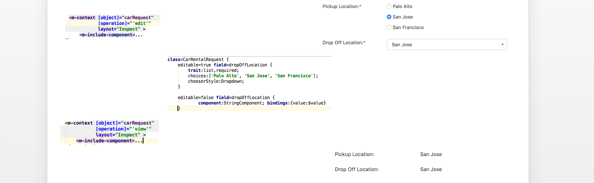

# MetaUI for Angular - the declarative UI


## Table of Contents

* [Description](#description)
* [Requirements](#requirements)
* [Installation](#Installation)
* [Limitations](#Limitations)
* [How to obtain support](#howto-obtain-support)
* [License](#license)


## Description

Based on our Ariba's past effort and its framework called _AribaWeb_ we are bringing over one of 
its core library called **MetaUI** into Angular world based fully on typescripts along with some necessary UI components to 
make declarative UI possible. 

<small>_Credit:  Based on original work: MetaUI: Craig Federighi (Ariba 2008)_</small>


Components are organized into 3 main areas:
 
 * **Core UI framework** providing reusable API which gives you additional layer on top of angular:
    * i18n support
        * hopefully this can be replaced by native Angular i18n support.    
    * App Configuration & bootstraping
    * Wrappers and services to work with restful API    
    * Convenient utility API for collections, language based operations
    * Unified Error management and Handling
 *  **UI Components** providing set of services and reusable components
    * Layouts
    * Widgets
    * Offers basic set of widgets which extending existing 3th-party libraries http://www.primefaces.org/primeng/ to match our custom usecases. 
    * Error handling
    * Formatters
    * Dom Utilities
 * **Meta UI** is our biggest thing which can assemble UI for you using rules
    
 
The rest of the sections are focused on the _MetaUI_ therefore it is recommended that you watch our online presentations that give
you some ideas about Rule driven User Interface.

 - [Introduction declarative UI](https://www.youtube.com/watch?v=-Bv_ceUn1K8)
 - [Longer MetaUI presentation](https://www.youtube.com/watch?v=F0BMw_Sxjig)
 
                    
      

### What is MetaUI
**MetaUI** is set of API and components which uses your model (in this case _model_ is your domain object and meta data 
describing this object - called Meta Rules) to dynamically assemble User Interface for you on the fly without templates. 
Rather than letting you layout your fields for every usecase. 

### Motivation

```
Most of the UI code written in traditional frameworks is a mechanical application of 
(unstated) rules rooted in the domain object data model.
  						            
  						            -- Craig Federighi 	
```

The main motivation behind all this reusability and to minimize duplicate code as developers has tendency to build 
for every domain object and every situation extra user interface.
 

### What is our Goal
Is to provide solution for generating fully functional UI application all only based MetaRules. Later on we are planing
 to be independent from actual component/widgets libraries. So the main goal is not trying to build reusable component (widgets) libraries 
rather provide a solution to be able to plug-in anything you need and let the Rules generate UI for you. 
  

**What do we mean fully by functional UI application ?**
 + MetaUI should not only generate single page forms but whole application with top level navigation followed by 
 dashboards and different kinds of content 
 + Integrated angular's routing so we can dynamically transition between different pages without letting user to 
 specify routes manually in the code. 
 + Each application should have full support to read/write data from/to REST API  - all this needs to be integrated as part of MetaUI
 + MetaUI is a platform providing full stack for creating UI applications (e.g.: authentication, logging, capturing 
 current user state, and much more.)
  
 

### Project status
MetaUI is still under active development, where we need to support full set of widgets and layouts. 

+ We completly re-implemented MetaUI into Angular along with basic set of functionality and widget library.
+ We have basic set of widgets and layouts to build fully functional forms
+ Meta Rules supports (on oss level) advanced layout (still need to implement the actual angular based components)
+ We do support Modules concept, where we have Application.oss.


## UI derived from Rules

_MetaUI_ is heavily motivated by CSS and to better understand how our _Meta Rules_ work let's review this picture bellow in 
order to find some similarities.


+ On the left side we have _HTML_ code which is just a div with _class=box_
+ In the middle we have simple CSS rule and when this is executed inside your desktop browser the _box_ class is matched
and blue rectangle is rendered.
+ If we run the same code on mobile device, the other rule is matched and at this time it will draw red circle. Extending 
common rule. 
 
 
 Using _CSS_  is great way to influence and change the way how your HTML code is rendered. 
 
 **MetaUI is similar**
 
 



+ In example before the environment along with the context was created by browser for us but in case of MetaUI we are creating it.
+ On the picture above we have on the left side a HTML code  - in this case its _special component_ tag **m-context** that actually 
creates a context for us
+ In this middle we have our rules just like we had css rule in previous example
+ When we run this code a fully functional UI is assembled for us.
    + We are just changing the way our UI is generated just by modifying our rules.
    + In this case we are creating a context for object _carRequest_ for operation _View_ and later on for _Edit_ and layout _Inspect_
    + By specifying just these 3 properties we are creating newContext and Meta Rules engine is tries to find the best match to figure out
     what UI to derive from it.


## Requirements

Project have dependencies that require  Node 8.9 or higher, together with NPM 5.5.1 or higher.

## Installation

Install `npm` packages:

```
    npm install --no-audit
```

Build for first time:

```
    npm run build
```
* This command assembles and copies necessary assets to the app directory. Once you run it then you can use regular `ng build`


Run development web server:

```
    ng serve
```

Now access [http://localhost:4200/play][1]


##### MetaUI Hacking

To start playing with the `oss rules` please checkout the [lib/meta-ui-parser.md][3] to know how.


## Limitations

Current implementation is based on PrimeNG widget library and we are working to make `MetaUI` widget library independent.


## How to obtain support

Please, do not open issues for the general support questions as we want to keep GitHub issues for bug reports and 
feature requests. You've got much better chances of getting your question answered on StackOverflow where the questions 
should be tagged with tag `sap-ariba` in the description you should mention metaui.

On the other side if you find some problem or have suggestion please do not hesitate to open up new issue and properly marking if this is a bug or 
feature suggestion.


## License

Copyright (c) 2017-2018 SAP Ariba or an SAP affiliate company. All rights reserved.
This file is licensed under the Apache Software License, v. 2 except as noted otherwise in the [LICENSE file][2].


   
 [1]: http://localhost:4200/play
 [2]: https://github.com/SAP/angular-metaui/blob/master/LICENSE
 [3]: https://github.com/SAP/angular-metaui/blob/master/lib/meta-ui-parser.md
 
 