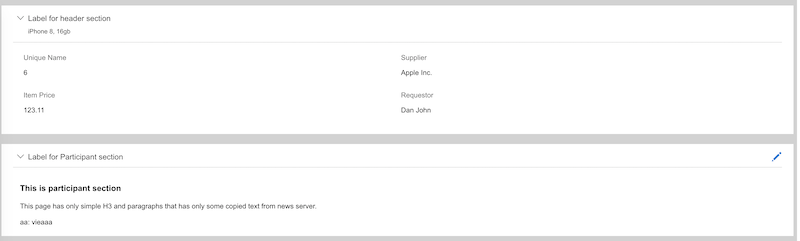

##  OSS Syntax

 
Rule format is inspired by CSS, but extended to support nesting and chaining and tweaked to deal with identifiers containing `.`s. 

**CSS**
```css
  div#toc a {
      text-decoration:underline;
  }
```


**OSS**
 ```ts
     class=User field=email {
         toolTip:"Your email";
     }

```

* **CSS**: if an `a` tag appears in a `div` named toc, set the property `text-decoration` to `underline`
* **OSS**: if a field named `email` appears in a class named `User`, set the property `toolTip` to `Your email`


### Basic syntax

#### Nesting

These are equivalent

```ts
class=User {
  field=firstName {
    editing=true { 
      visible:true; 
    }
  }
}

class=User {
  field=lastName {
    editing=true { 
      visible:true; 
    }
  }
}

class=User {
  field=email {
    editing=true { 
      visible:true; 
    }
  }
}


```
or 

```ts
class=User field=firstName editing { visible:true; }
class=User field=lastName  editing { visible:true; }
class=User field=email editing     { visible:true; }

```

or 

```ts
class=User editing {
    field=firstName { visible:true; }
    field=lastName  { visible:true; }
    field=email     { visible:true; }
}
```

or 

```ts
class=User editing field=(firstName, lastName) {
    visible:true; 
}
```


#### Values

Values can be Boolean, Integer, String, List, Map, and Expressions 

```ts
field=password {
    // boolean
    editable:true;
    
    //String literal quoted
    toolTip:"This is required";
    
    // This is how specify list of values 
    trait:(required, secret);
    
    // String literal (unquoted)
    component:AWPasswordField;
    
    // Map
    bindings: {
        size:20;
    }
    
    // Expression
    valid: ${ value.length > 5 } 
}
```


#### Traits

Like CSS classes: Used to assign sets of properties. E.g.:

```ts
class=User {
    field=password {
        trait: required, secret;
    }
}
```

is expanded to:

```ts
class=User {
      field=password {
          // When editable use PasswordFieldComponent
          editable {
                  component:PasswordFieldComponent;
          }
          
          // If in operation edit or create make it mandatory with defining custom validity condition
          operation=(edit, create) {
            required:true;            
            object {
                valid: ${(value != null && value !="") ? true : "Answer required"}
            }
          }
      }    
}
```

Since `build-in` rules contains following trait definition:

```ts
field trait=secret {    
    editable {
        component:PasswordFieldComponent;
    }
}

field trait=required operation=(edit, create) {
    required:true;
    object {
        valid: ${(value != null && value !="") ? true : "Answer required"}
        }
    }
}
```


#### Declaration

* When _MetaUI_ collects lists of modules, layouts, classes, or actions to display it matches declared items (in the current context, that are visible).
* Some items are declared automatically based on introspection
  * Please see [IntrospectionMetaProvider][1] in the ObjectMeta
* Others can be added with the “@ Notation” in .oss files.


**A derived field declaration:**

```ts
class=User {
  @field=fullName {
      value:${firstName + " " + lastName};
  }
}
```


**List of section layouts**

```ts
layout=InvoicePage#Sections {
    @layout=Header#Form {
        zonePath:Header;
        title:"Label for header section";
        description:$object.itemDescription;
        opened:false;
    }

    @layout=Participant {
        title:"Label for Participant section";
        visible:true;
        canEdit:true;
        component:Section2Component;
        editing {
            bindings:{
                oper:'editx';
            }
        }
        editing=false {
            bindings:{
                oper:'vieaaa';
            }
        }
    }
```




 ### Advanced syntax


#### Traits

These are equivalent:
 
```ts
field=firstName {
    trait:required;
}
```

vs

```ts
// with # trait assignment 
field=firstName#required;
```
 
 
 
#### Field rank

```ts
field=firstName {
    after:zLeft;
    trait:required;
}
field=lastName {
    after:firstName;
    trait:required;
}
field=password {
   after:lastName;
   trait:required,secret;
}

```

vs using predecessor operator

```ts

zLeft => firstName#required => lastName#required => password#required,secret
```

# Expressions

Expressions are wrapped in `${…}` and use JS syntax to execute also javascript code
The `“this”` is the `Context object` – key paths reference assignments in context

  * This is one of the reason why we actively thinking about new way how to be less dependant on OSS any legacy expression libraries
  while trying to more close to the code. This is phase [OSS Files and its next phase][2] 


```ts
object field=bio{
    editable: ${object.credits > 50}
}
object @field=fullname {
    value: ${object.firstName + “ “ + object.lastName}
}
```

The context has special keys for value and properties 


```ts
field=budget{
    valid: ${value >= 0 ? true : "Budget must be non-negative" }
}

field {
    fancyLabel:${properties.label + "!!!"}
}
```


#### Grammar

**`rules ::= rule *`**
  * A OSS Rule file can have more then one rule defined in the file. Each rule can nest other rules as well


**`rule ::= selector+  traitList? ('{' ruleBody  '}' | ';')`**
  * Each rule starts with selector or selectors and can be followed by list of traits.
    * If you remember we mentioned in the advanced syntax that trait can be written like this `#required ` with `#` character

**`traitList ::= '#' IDENTIFIER  (',' IDENTIFIER)*`**
 * When using trait advanced syntax then we start with `#` character and add one or more trait delimited by comma
 
 
**`**selector ::= '@'? (selectorDef |  '~' IDENTIFIER_KEY)**`**
  * A selector can start with `@` in case we are declaring a field
      ```ts
         @field=fullName {
              value:${firstName + " " + lastName};
          }
      ```
  * Followed by one or more _selector definition_ which is always key/value or just one or more  _identifier_. You probably saw this already. We can say
       
```
               class operation=edit {               
                   field { editing:true; }               
               }
```
which is equivalent to:
       
```ts
               class=* operation=edit {               
                   field=* {
                    editing:true; 
                   }               
               }
```
      


**`selectorDef ::=  IDENTIFIER_KEY   selectorValue?`**
 * The selector definition  is just a key which is always string and can have a value. If does not have value then there is a implicit `*`
 or `true` assigned

**`selectorValue ::= '=' (simpleValue | '(' valueOrList ')' )`**
  * When value is assigned there is a always `=` sign followed by simple value :
    * String literal
    * true or false
    * null 
    * integer or float 
  
  
* or complex value such as :
  * List
  * map
  * expression
  * field path with `.`s
  * and others

**`ruleBody ::= ruleBodyKeyValue*  rule* ruleBodyKeyValue* rule* precedenceChain*`**
* Rule body contains actual properties (key/values) or can contain other rules
* They can also contain at the end of definition the chain of predecessor operators 
  * the `zLeft => aaa => bbbb;`

**`ruleBodyKeyValue ::= (key ':' value '!'? ';'? )`**
* Just like in css its key/value pair. you can add `!` character  to override existing rule (something like `!important`)


[1]: https://github.com/ngx-meta/rules/blob/master/libs/rules/src/lib/metaui/core/object-meta.ts
[2]: https://github.com/ngx-meta/rules/projects


