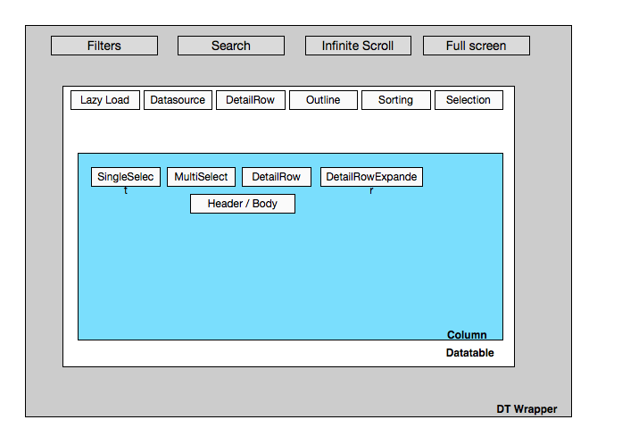
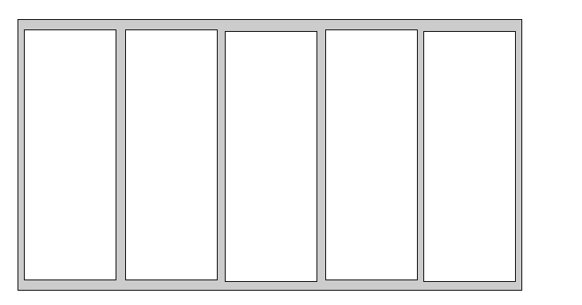
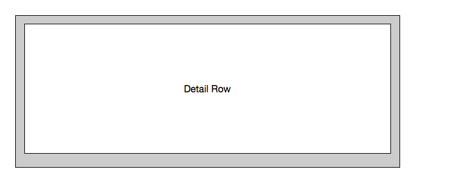
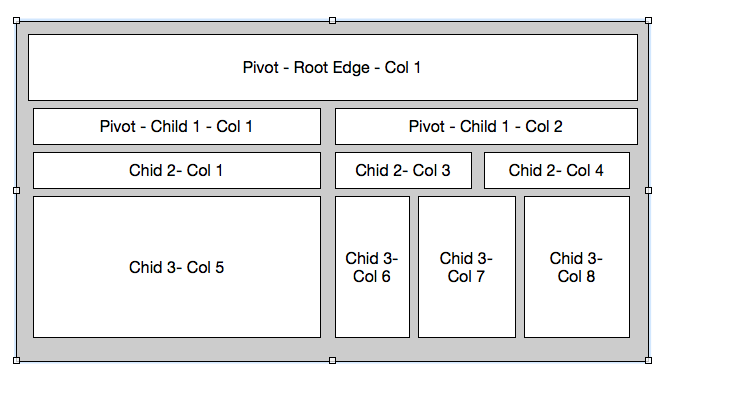
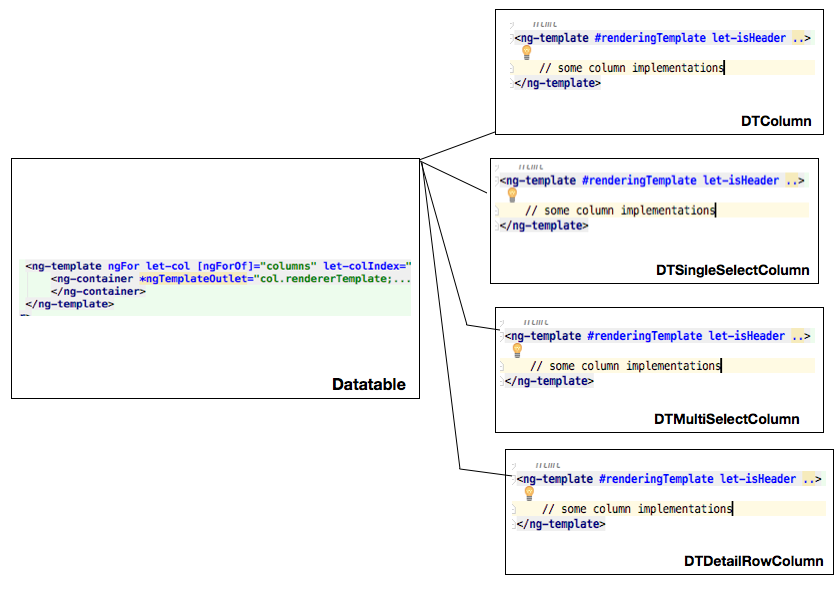
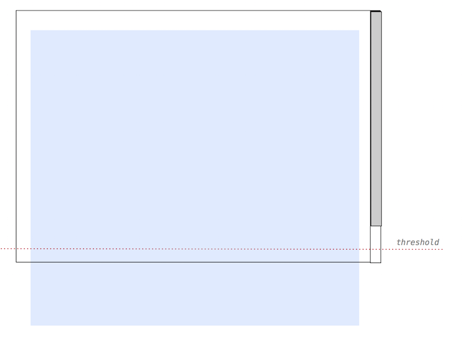
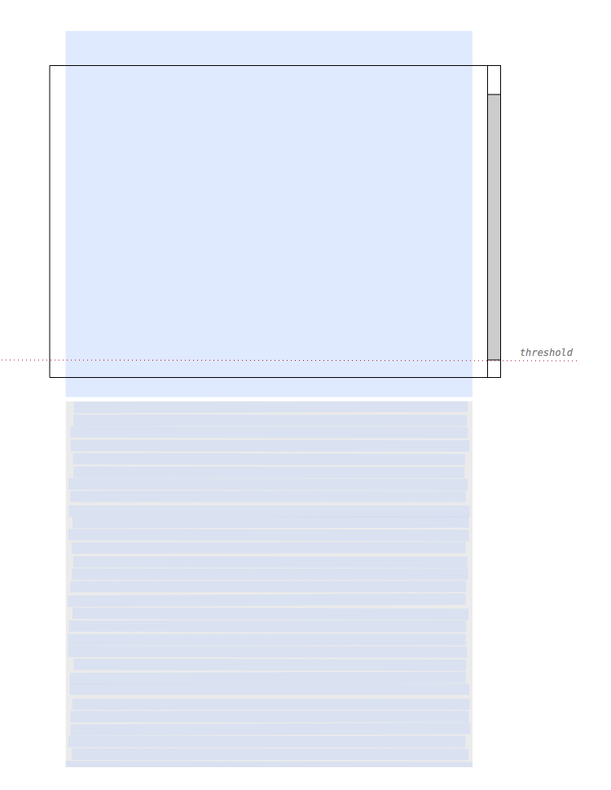
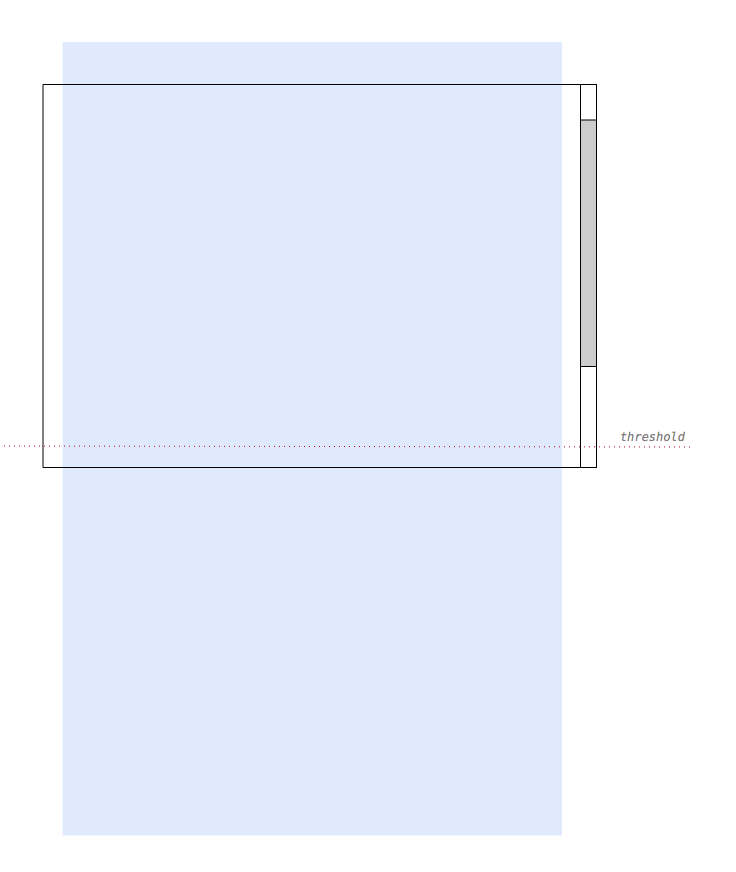
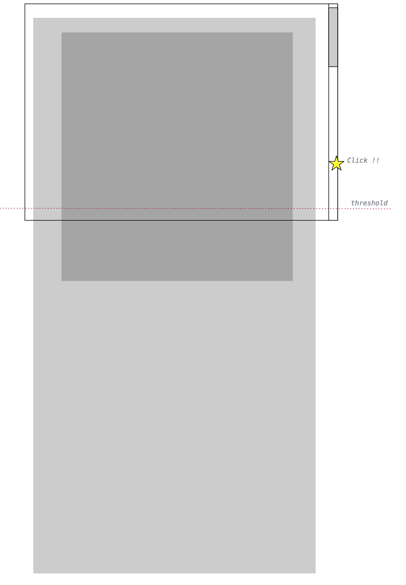
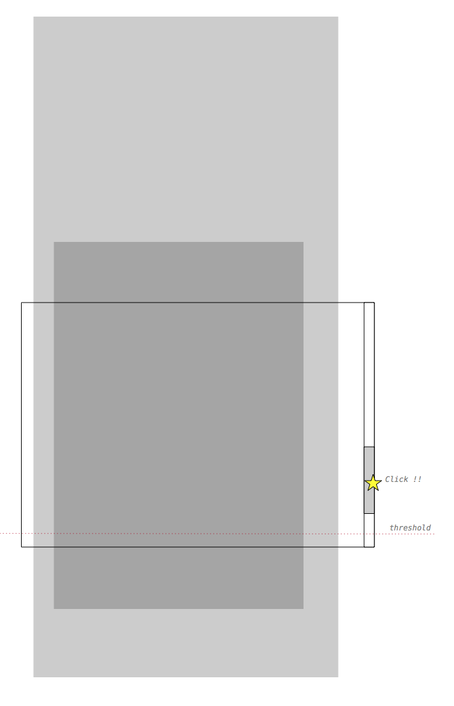

# Datatable (DT)
 
Datatable implements data grid that is used to render tabular-like data. Original structure is based on 
PrimeNG datatable but it was completely rewritten and refactored into smaller pieces to allows us more extensibility. Therefore
this document focuses more on how the DT is implemented rather than how it is used. 




As you can see above DT component has 3 major parts:

* DT Wrapper component
* Datatable component
* DT Column component(s)


## DT Wrapper

This component is handling everything around DT which does not necessary belongs to DT such as:
* Wrapper is responsible for laying out header, data, footer
* Wrapper is handling all the filtering and searching and sending it to the DT
* Wrapper introduces infinite scroll.

But the main goal of this wrapper is to remove all the common surrounding parts around the DT and make sure DT can focus only 
actual header and body data rendering.


```html
<div [ngClass]="dt.styleClass" [class.dt-full-screen-mode]="isFullScreenMode">
    ...
    <div class="dt-header" *ngIf="dt.showTableHeader">
        <ng-template *ngIf="dt.header; then appDefinedHeader else defaultHeader"></ng-template>
    </div>

    <div class="dt-body-wrapper">
        <table [ngClass]="dt.tableStyleClass" >

            <!-- Render TH header rows-->
            <thead class="dt-thead">
            <ng-container *ngTemplateOutlet="headerRows;"></ng-container>
            </thead>

            <!--
                Render data rows. For data rows we need to keep tbody tag inside DT table
                due to Outline
             -->
            <ng-container *ngTemplateOutlet="bodyRows;"></ng-container>
        </table>
    </div>
    ...
</div>


```
 In the code fragment above you see a _header_ which renders either _default header_ that has a filtering as well as search functionality or it can be replaced
 by custom code. _Body_ section uses regular HTML table to render its data using _ngTemplates_. 
 
At the bottom of the _Wrapper_ we have _infinite scroll components_ which is able to detect how far we are from the bottom edge in order to load additional data. 

 ```html
<aw-infinite-scroll #infiniteScroll *ngIf="isFullScreenMode"
                    [distance]="'10%'"
                    [fetchSize]="dt.state.limit"
                    (onLoad)="onLazyLoad($event)">
</aw-infinite-scroll>

```


## Datatable

In the DT everything is centered around columns and I will get into columns in more detail but this is pretty much the main difference to any other implementations
 such as _PrimeNG_ or _Angular Material_. Treating everything as column gives us great way to render any kinds of structure. 

Please see following examples:

#### Regular Columns




#### Detail row column




#### Pivotal row column


* _Future pivotal_ layout was probably the main reason why I chose to treat everything as column. Since pivot is nothing else
than connected directional graph with 1 root and the edges are implemented by columns with variable column span. 

 
When you look at the _datatable2.component.html_ you will see several smaller section with following entry point:

```html

<aw-dt-wrapper #dtWrapper>
    <ng-template #headingArea>
        <ng-content select="aw-dt-header2"></ng-content>
    </ng-template>

    <ng-template #headerRows>
        <ng-container *ngTemplateOutlet="header;"></ng-container>
    </ng-template>

    <ng-template #bodyRows>
        <ng-template *ngIf="isOutline(); then bodyOutline else bodyPlain"></ng-template>
    </ng-template>

</aw-dt-wrapper>

```


In this code fragment we are using *DT Wrapper t*o layout each section of the DT. Each section (header, bodyOutline, 
bodyPlain) is treated as separate templates for better readability and extensibility. 


Before I start describing this HTML template it is important to understand how datatable is structured inside _.ts_ file and how it is
initialised:

###### **1. ngOnInit**

* **Initialize Datasource**
    * All the data communication is handled by DataSource that has DataProvider & DataFinder. we initialize DS and subscribe to all the updates
    
```ts
        /**
         * If the data are not deferred and we get list directly then it creates DS. If
         * ngOnChanges is called first we properly init DS and clean this.list
         *
         */
        if (isPresent(this.destinationClass) || isPresent(this.list)) {
            this.initDatasource();

        } else if (this.dataSource.initialized) {
            this.initDatasource(false);
        }

```


* subscribe to data changes:

```ts
 this.dataSource.open().subscribe((data: any[]) =>
        {
            this.updateList(data);
        });
```

We don't directly change the data, all the changes are coming thru the DS and the DS is the one to tell DT to update its content.


* **Init programmatic columns**

```ts
        // init default columns
        this.rowDetailExpandColumn = this.factoryResolver
            .resolveComponentFactory(DTDetailRowExpanderComponent).create(this.injector).instance;


        this.multiSelectColumn = this.factoryResolver
            .resolveComponentFactory(DTMultiSelectColumnComponent).create(this.injector).instance;

        this.singleSelectColumn = this.factoryResolver
            .resolveComponentFactory(DTSingleSelectColumnComponent).create(this.injector).instance;

```
* This is one of the advantage of this implementation since everything is column and I can also programmatically instantiate e.g. 
_SingleSelectColumn_ that renders radio buttons and add it as first item into column's array and let it automatically render with other 
columns. I don't have to do any additional work. 


###### **2. ngAfterContentInit**

After content is initialized we need to initialize our columns. Besides converting _QueryList_ to regular array we also update this 
array with already mentioned programmatic columns.


```ts
initColumns (): void
    {
        this.columns = [];

        if (this.detailRowExpansionState.detailExpansionEnabled) {
            this.initDetailColumnExpansion();
        }
        if (this.hasLeadingSelectColumn() && this.selectionMode === 'multi') {
            this.columns.push(this.multiSelectColumn);
        } else if (this.hasLeadingSelectColumn() && this.selectionMode === 'single') {
            this.columns.push(this.singleSelectColumn);
        }

        /**
         * Add expansion column when detail row is enabled
         */
        if (this.detailRowExpansionState.detailExpansionEnabled && !this.isOutline()) {
            this.columns.push(this.rowDetailExpandColumn);
        }

        this.colsQuery.forEach((col: DTColumn2Component) =>
        {
            col.initialize();
            this.columns.push(col);
        });

    }
    ....
```


* **Handle selection**

Depending on the DT selection mode DT is handling all the events. e.g:

```ts
    onHandleRowClicked (event: any, item: any): void
    {
        if (this.selectionMode === 'multi') {
            this.onRowToggle(event, item);

        } else if (this.selectionMode === 'single') {
            this.onRowSelect(event, item);
        }

    }
```

```ts
 onCellSelectionChange (cell: any, column: DTColumn2Component, item: any)
    {
        if (this.selectionMode !== 'cell') {
            return;
        }
        let lookupKey = {
            col: column.key || column.label,
            item: item
        };
       ...
       
    }               
```

They are other method events as well. It's important to note that even these events can originate somewhere else; DT is the main component that decides 
how to handle them. 


* **Datatable state**

DS which is initialized as part of the _ngOnInit_ process also instantiates DT state that stores runtime information about the
DT:
    
    * offset, limit - for lazy loaded
    * displayLimit - to start with some number of records that are initialized loaded in non-full screen mode
    * sortKey - current active sorting column
    * sortOrder - current active sorting direction (ASC | DESC)
    * currentSearchQuery ...
    * etcs. 

We use DS state to persist or load these runtime information.


Now let's have look how we render these columns in HTML:

At the top I showed you _DT wrapper_ which is using _ngTemplate_ block to break down header and body into its own subsection

```html
    <ng-template #bodyRows>
        <ng-template *ngIf="isOutline(); then bodyOutline else bodyPlain"></ng-template>
    </ng-template>
```

We start with the rows ( iterating our data - _dataToRender_):

```html
<ng-template #bodyPlain>
    <tbody [ngClass]="{'dt-content dt-data-cells ': true, 'dt-is-hoverable-row': rowHover}">

        <ng-template ngFor let-rowData [ngForOf]="dataToRender" ...>
    
            <ng-container *ngTemplateOutlet="rowTemplate; ...">
            </ng-container>
            ....
        </ng-template>    
    </tbody>
</ng-template>

```

and each **_rowTemplate_** reads given object and column list to render both header and data body.


```html
<ng-template #rowTemplate let-rowData >

    <tr #rowElement (click)="onHandleRowClicked($event, rowData)" ...>

        <ng-template ngFor let-col [ngForOf]="columns" let-colIndex="index">
            <ng-container *ngTemplateOutlet="col.rendererTemplate;...">
            </ng-container>
        </ng-template>
    </tr>
</ng-template>
```

In above fragment we are delegating column rendering to its specific implementation - **col.rendererTemplate;**. DT again is not aware what is rendered. 



Besides some other details this all you need to know to dive in and investigate or update different areas if needed. To keep things simple I haven't gone e.g. into Outline section where I use outline control as the main part is identical.


## DT columns

Column is main part of the DT. We have different implementation of the columns:

-  Default columns rendering header and body with data
-  Selection columns
-  Detail Row columns

New columns needs to extends _DT2ColumnComponent_ to inherit some of the required properties and needs to implement template in
following format:

```html
<ng-template #renderingTemplate let-isHeader ..>

    // some column implementations   
</ng-template>
``` 

```html
<ng-template #renderingTemplate let-isHeader let-isSubHeader="isSubHeader" let-column="column" ..>

    <ng-template *ngIf="isHeader" [ngTemplateOutlet]="colHeader" ...> </ng-template>

    <ng-template *ngIf="!isHeader" [ngTemplateOutlet]="colBody">
    </ng-template>
    
</ng-template>
``` 


* It must have a ng-template called _renderingTemplate_  which is use by DT to render the content

e.g. for Single select column implementation 

    
   * Header is empty not like in case of multi-select where we need to put additional checkbox - _select all_
   * Body contains radio-button components
   

```html
<ng-template #colBody let-data="data" let-rowIndex="rowIndex" , let-level="level">

    <td #cell [class]="dynamicBodyClass(data)"...>
        <aw-radiobutton [name]="'DTRadio'" [value]="data" [(ngModel)]="dt.state.selection">
        </aw-radiobutton>
    </td>
</ng-template>
```   
In case of single/multi selection we don't directly listen on these widgets to trigger selection event back to the DT, but we have 
_onHandleRowClicked_ click event on the row and this toggles states and checkboxes or radio buttons just renders a currrent state.


#### Detail row

Detail row has the same format. Again we have _renderingTemplate_ but here we set correct column span so it expands all the way.

```html
<ng-template #renderingTemplate let-column="column" let-rowData="data">

    <tr #detailRowElement class="dt-body-row dt-detail-row">

        <td *ngIf="dt.hasInvisibleSelectionColumn()" width="1px"></td>
        <td *ngIf="visibleLeadingCols() > 0" colspan="visibleLeadingCols()" width="1px">
            &nbsp;&nbsp;
        </td>
        <td [attr.colspan]="dt.startOfFirstDataColumn" [class]="dynamicBodyClass(rowData)"
            [ngClass]="{ 'dt-is-default dt-cell-def': true}">

            <ng-container
                *ngTemplateOutlet="bodyTemplate; context:{$implicit: this, rowData:rowData}">
            </ng-container>
        </td>
    </tr>
</ng-template>
```

In similar way we are free to implement different kinds of columns where the HTML code as well as TS logic stays inside its specific column 
implementation and does not mix together with the DT implementation


#### Fullscreen mode

Currently when we want to browse thru larger dataset we use full screen or full page mode might be better fit. Here we load data 
lazily as you scroll down.  The way it works is shown on the pictures bellow:


* Datatable is initialy loaded with enough data that goes over the bottom edge of the browser. There is a _binding_ for it so you can set as much as data 
you want to load. Based on the row's heigh we calculate where we are and what is the distance to the bottom of the browsers
* We set virtual threshold which tell us if the scrollbar hits this line send event to the **DataSource** to request additional data



* On the next picture you see: Scrollbar reached our threshold line and datatable is adding addional data



* And scrollbar is changed to reflect the height of the document



This solution is fine when you want to scroll over larger dataset as it always load more and more data lazily as you 
keep scrolling. This also have one downside as you keep scrolling you are adding more and more data to the dom which might slow
down the application because the DOM gets larger, there is more memory needed and Javascript needs to process more and do 
more calculations, etc..

To keep DOM healthy at minimum when you scroll up and reaching the top of the document we clean up the dom and drop everything
from bottom. (to improve this see _scroll faulting technique._)


### Future and current Work:

This section list some planned work and some recommendation how to implement it:

**1. Freeze Column**

There is already implementation for to freeze column and its sufficient enough for current use case but for the future work it is desirable to better visualize which column
is frozen and maybe to be able to pin it.  


**2. Column hiding**

This should be straight forward as each column has a visibility property and we just need inside the DT Wrapper render some popup menu to check and uncheck column and change
this boolean property. 

 
```html
<ng-template #colBody let-data="data" let-rowIndex="rowIndex">

    <td #cell [ngClass]="{ 'dt-is-default': true,
        'dt-cell-def': !isCellSelectable(data),
        'dt-is-hidden': !isVisible}">
                
```

When **isVisible** is false then we apply _display:none_ on **th/td**

**3. Column sorting**

Single column sorting is already implemented we just need update existing implementation once there is a UX available with proper icons. To support multi column sort, we need to change
inside the DT the _**sortColumn**_


```ts
 /**
     * When sorting is enabled this is current active column being sorted.
     *
     *  - we dont support multiple column sorting
     */
    public sortColumn: DTColumn2Component;
```

to make it array and sorting algorithm to sort by these additional columns. Original event is coming from _DTColumn_ where we listen for _header (click) event_. Instead of setting
DT.sortColumn as it is in current solution we will push  new column to this array. 
* I would probably create new @Input property some sorting mode ([multiSort=true/false]) to tell DT if we want to sort by 1 or more columns
and based on this I would call _**dt.sortSingle_** or _**dt.sortMulti**_


```ts
 sort (event: any)
    {
        if (!this.sortable) {
            return;
        }
        let targetNode = event.target;
        if (this.domHandler.hasClass(targetNode, 'dt-u-sortable') ||
            this.domHandler.hasClass(targetNode, 'dt-col-title') ||
            this.domHandler.hasClass(targetNode, 'dt-col-sortable-icon')) {

            if (isPresent(this.dt.sortColumn) && this.dt.sortColumn.key === this.key) {
                this.sortOrder = this.sortOrder * -1;
                this.sortOrdering = this.dt.sortOrderingForNumber(this.sortOrder);

            } else {
                this.dt.sortColumn = this;

            }
            this.dt.dataSource.state.sortKey = this.key;
            this.dt.dataSource.state.sortOrder = this.dt.sortOrderingForString(this.sortOrdering);

            this.dt.sortSingle();

            this.dt.onSort.emit({
```


 
**4. Change column width**

A way to manually set column _**width**_ by dragging its side with the mouse. This is something I would put directly into DTColumn main component, here I would listen for mouse event, delagate this to DT and 
DT would decide how to handle it. Each DTColumn has a _[width]_ property that can be set and used for this case.


**5. Support Drag & drop**

Support _drag and drop_, meaning reordering of rows as well as columns. This is something that needs to sit inside DT. For this we can utilize PrimeNg directive to mark something 
draggable and droppable, and implement necessary method to reorder rows or columns
 

###### Row Dragging

Drag & Drop support should not be so difficult we just need to approach it from the right angle from simple code to more complex code:

**1.  Bind listeners**
 
 * We need listen for the right events so probably we need to execute a command outside of angular zone and start listening for 
 events such us:
    * Mouse Down
    * Drag Start
    * Drag Over 
    * Drag Enter
    * Drag Leave
    * Drag Drop
        
        
    
You can read about each even here: https://developer.mozilla.org/en-US/docs/Web/API/HTML_Drag_and_Drop_API:

* For this use case I would create a directive let's call it `dt-draggable-row` that inside `ngInit()` setup these above events
and in `NgDestroy`  clear up all these listeners and unbind everything
* I would not listen all the time. I would probably have a binding inside this directive where DT would tell the directive "Hey, Listen or dont listen"
Or simply we would probably inject parent DT into Directive's constructor where I can ask directly `this.dt.rowDnsEnabled` which could be a binding on DT. 
    
    
    
```ts

@Directive(' selector -> dt-draggable-row')
export class DTDraggableRowDirective ... 
{
    @Input()
    dndEnabled: boolean = false;
    
    @Input()
    dndRowIndex = 0

    // private    
    //listeners handlers here - the return from .bind(this)
    
     // need to have reference to main table which will call 
     constructor(private myTable: Datatable2Component, private ngZone: NgZone, also elememntRef needed) { 
     }
    
    ngInit() {
        if (this.dndEnabled) {
            this.setupEventListeners();
        }        
    }
    
    
    setupEventListeners() {
          this.ngZone.runOutsideAngular(() => {
                 this.mouseEvenHandler = this.onMouseDownEvent.bind(this);
                         this.thisElem.nativeElement.addEventListener('mousedown', this.mouseEvenHandler);
                         
                 ... other listeners           
          });
    }
    
    
    private onMouseDownEvent(event: any)
    {
        ...
    }
    
    ngInit() {
        if (this.dndEnabled) {
           this.removeEentListeners();
        }
    }        

}

```    
  
The _thisElem_ is `ElementRef` and would refer to `TR` that we are dragging. 

To Attach this directive to the DT you could plug it in `datatable2.component.html`. At the bottom there is _row template_


```html
<ng-template #rowTemplate let-rowData let-even="event" let-odd="odd" let-rowIndex="rowIndex"
             let-nestingLevel="nestingLevel" let-colsToRender="colsToRender">


    <!-- DT will have some binding that woudl turn on/off drag and drop support-->
    <tr #rowElement dt-draggable-row dndEnabled="rowDraggable" dndRowIndex="rowIndex"
        (click)="onHandleRowClicked($event, rowData)" class="dt-body-row"
        ...
    </tr>
</ng-template>

```


**2.  Handling Events**

Since we have a reference to parent DT, we can now broadcast events to the DT where DT implements necessary logic.
I dont know now and it really depends on the implementation details if I would hide more logic in this directive or parent DT. There are many great
examples how to do drag&drop for HTML5.

What I know now for sure:
* on `MouseDown` I would mark my current dragged element
    * I would insert a class so I can identify this element and 
    * Mark element as dragable. 
    * Have some boolean flag _isDragging_ to tell me if I am in the middle of this D&D operation.
    
 https://www.w3schools.com/html/html5_draganddrop.asp
 
e.g:

```ts
 private onMouseDownEvent(event: any)
    {
        // CHECK if current event.element is draggable. in the directive insert a a class to the TR that supports draggable        
        this.thisElem.nativeElement.draggable = true;
        this.isDragging = true; // or probably put it directly as internal property to DT itself
        
        // we just enabled dragging
    }
   
``` 

*  **TR** would be _Draggable_ and _Dropable_ at the same time. 
* on `Drag Over` and `Drag leave` I would be adding and remove classes for the TR being under this dragged TR to create and effect something 
 is being dragged over and also show user where where are visually.
* on `Drag End`   you reset everything and remove your temporary classes.
* on `Drag drop`  I would broadcast new index for current dragged TR and do array items reordering.


**3.  Drag & Drop API**

There is a Drag & Drop API which exposes a `DataTransfer` object to store temporary data during your D&D operation. You can also
change the behavior of the dragged elements or do some styling.
 
For more info:
    
    https://developer.mozilla.org/en-US/docs/Web/API/DataTransfer
    
    https://developer.mozilla.org/en-US/docs/Web/API/HTML_Drag_and_Drop_API

for example _onDragStart_ you would do following:
* Save index of current TR to the 

```ts

 onDragStart(event) {               
        event.dataTransfer.setData('text',  this.dndRowIndex);   
    }

```

I suggest to read the _D&D API link_ so you can get better understanding what is possible.

**3.  Where to start**

At the begging it will be mostly experiments to get familiar with the D&D:

* I would start with directive that is attached to above row template implementing all the events and make sure when DT is 
destroyed it will remove my listeners also
* Start playing with the events so on the _Drag Start_ I would mark my element draggable to see what is the default behavior and let print each listener event details to console to 
understand what it is doing
    * I would google and search and read as many examples as possible. 
* Then I would try to style and control the look & feel dragged TR so its clear that we are dragging specific `TR` over some `TR`
    * again there are many examples.
    * By default browser generates transparent image from the dragged element which follows the mouse pointer but you can change again using `DataTransfer` so set your 
    image.
* After I would focus on DROP event where I would print out current element that I drop my dragged element onto.
    
```ts
onDropEvent(event) {
        //event will contain current element you are droping your element into
        // since we are inside Directive we have handle to this.thisElem.nativeElemement current dragged element.
    }
        
``` 

* Once the main vehicle of all these events is working for me I could start with more code and create @Output events to tell the application
something changed. and also reorder the array elements. 
* I would finish all this with one last refactoring and documenting the code to make sure the code looks good as well.

 
 

**6. Pivotal support**

This is probably the biggest piece to get maximum out of DT. The way to do this we need to implement pivot state which would be able to aggregate data, create and reorganize columns 
into a tree of nodes and let the DT render it. 

For this we will have to implement some additional Columns to render RowDetails, ColumnAttributes, and ColumnsAttributes details. These would be just regular columns with ability to set 
different column spans.


**7. Scroll Faulting technique for the full screen mode**

The problem with our current solution as you keep loading more and more as you keep scrolling, you can't really jump 
ahead and e.g. you want to see some data that are at the end of the list because the data hasnt been loaded yet the _Scrollbar_ let's you work only 
with currently rendered list.

To improve it this technique guarantees that you keep only required set of rows that 
you are currently using. On the internet they call this by different names and something similar was done many times e.g. iPhone table 
component is using something similar to keep in the display only data you need to see.




 You size your wrapping div or it could be some helper invisible div to the height calculated based on 
the row height and expected of number of records.

* Here besides retrieving current dataset e.g. offset 200 and limit 50 you would need to return the total count of your records

This way browser _Scrollbar_ is adjusted accordingly to the total number of records without being affected by actual data content. You would be
able to click then at some position it would gets you to the bottom of the page.



 


 
   
   
    


 


 


  

    


 
 


